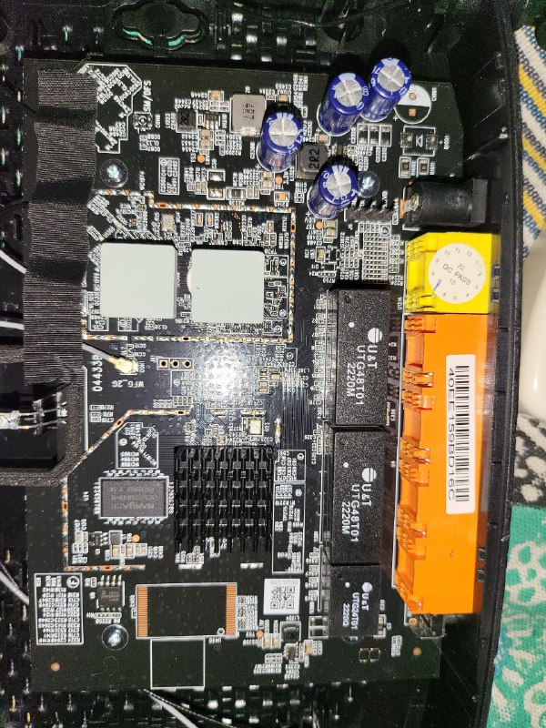
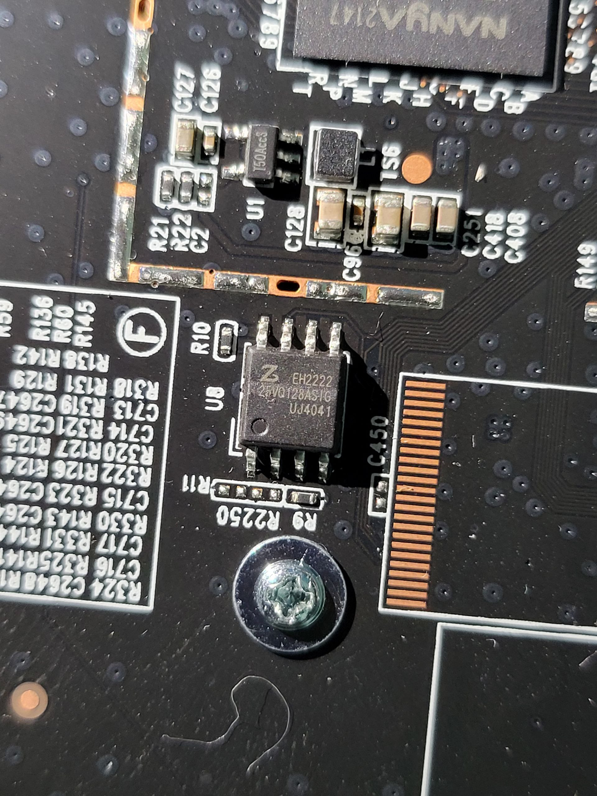
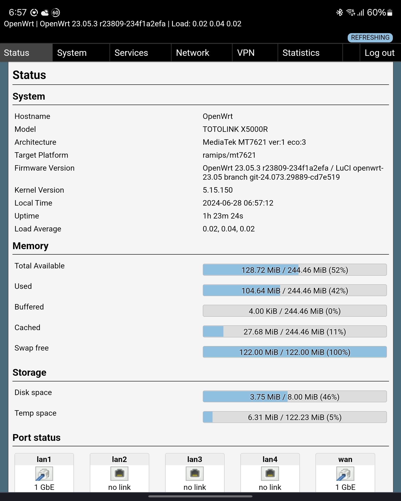

## Table of Contents
1. [Introduction](#introduction)
2. [Recovery from Bootloop](#recovery-from-bootloop)
   - [Interrupting the Boot Sequence](#interrupting-the-boot-sequence)
   - [Flashing via TFTP](#flashing-via-tftp)
   - [Upgrading via LuCI](#upgrading-via-luci)
3. [tftpd-hpa Configuration](#tftpd-hpa-configuration)
4. [Full Bootloop Recovery Log](#full-bootloop-recovery-log)
5. [Hardware Images](#hardware-images)
6. [Build Versions](#build-versions)
   - [23.05.2](#23052)
   - [23.05.3](#23053)
   - [23.05.4 and 23.05.5](#23054-and-23055)
   - [24.10 Onwards](#2410-onwards)
7. [Reverting to Stock Firmware](#reverting-to-stock-firmware)
8. [Build Scripts and Patches](#build-scripts-and-patches)

---

## Introduction
Totolink X5000R | SPI-NOR chip: Zbit Semiconductor part #ZB25VQ128ASIG

This repository provides an **OpenWRT** build with added **Zbit** support for the **Totolink X5000R** router. The SPI‑NOR chip supported is Zbit Semiconductor part **ZB25VQ128ASIG**.

### Compatibility Update
It seems even if you don't have this flash chip, this openwrt version with zbit patch boots fine according to this thread -- [TOTOLINK X5000R – any way to determine the Flash chip used on software level?](https://forum.openwrt.org/t/totolink-x5000r-any-way-to-determine-the-flash-chip-used-on-software-level/178494/5?u=akm-04). So I'd suggest if you don't know which flash chip you have and want to avoid bootloop, flash any openwrt firmware from my repo, after booting check which flash chip you have using ssh (run "dmesg | grep spi-nor"). If it's not zbit chip you may switch to official version of openwrt.
If your flash chip is Zbit, it should show something like this:
```plaintext
akm@HP450G1:~$ ssh root@192.168.1.1
The authenticity of host '192.168.1.1 (192.168.1.1)' can't be established.
ED25519 key fingerprint is SHA256:z6ncmRRcOteySyWN4m0gin2jAbIADfWrW+14pmshFqE.
This key is not known by any other names.
Are you sure you want to continue connecting (yes/no/[fingerprint])? yes
Warning: Permanently added '192.168.1.1' (ED25519) to the list of known hosts.


BusyBox v1.36.1 (2025-04-13 16:38:32 UTC) built-in shell (ash)

  _______                     ________        __
 |       |.-----.-----.-----.|  |  |  |.----.|  |_
 |   -   ||  _  |  -__|     ||  |  |  ||   _||   _|
 |_______||   __|_____|__|__||________||__|  |____|
          |__| W I R E L E S S   F R E E D O M
 -----------------------------------------------------
 OpenWrt 24.10.1, r28597-0425664679
 -----------------------------------------------------
=== WARNING! =====================================
There is no root password defined on this device!
Use the "passwd" command to set up a new password
in order to prevent unauthorized SSH logins.
--------------------------------------------------
root@OpenWrt:~# dmesg | grep spi-nor
[    1.548400] spi-nor spi0.0: zb25vq128 (16384 Kbytes)

   ```
If it's not zbit flash chip, it should show other chip name, example:
```plaintext
Mon Jul 15 22:26:04 2024 kern.info kernel: [    0.650569] spi-mt7621 1e000b00.spi: sys_freq: 220000000
Mon Jul 15 22:26:04 2024 kern.info kernel: [    0.657367] spi-nor spi0.0: en25qh128 (16384 Kbytes)
   ```


This openwrt builds in this repository matches the official OpenWRT release, except that it includes the Zbit patch applied and compiled locally. For details on the patch, see the [Zbit Pull Request](https://github.com/openwrt/openwrt/pull/12475/commits/387ed1aecfe1a0c9c01fbcb3f8d7a873afa5a885). I've personally tested and can confirm that each firmware boots correctly on my Totolink x5000r with Zbit flash chip.


Initially, I flashed OpenWRT without verifying my flash chip, ignoring the large warning at [OpenWRT Totolink X5000R](https://openwrt.org/toh/totolink/x5000r). This resulted in my router entering a bootloop. I fixed it using the serial flash method as described in this [thread](https://forum.openwrt.org/t/got-stuck-on-system-running-in-recovery-initramfs-mode-totolink-x5000r/160442/117).
> **Warning:** Always verify your flash chip before flashing. Ignoring warnings on the [OpenWRT Totolink X5000R page](https://openwrt.org/toh/totolink/x5000r) can result in bootloops.

---

## Recovery from Bootloop
I've managed to recover from bootloop by following these steps. If your router enters a bootloop, follow these steps to recover.

### UART Pin Location

The router’s UART header sits at the top‑left of the motherboard, just behind the power jack and beside the capacitors. You’ll see **four long pins** marked **TX**, **RX**, **VCC**, and **GND**. Simply attach jumper wires—no soldering required—to these pins and plug into your USB‑to‑serial adapter (only three pins are used). -- see [Motherboard picture](#hardware-images)

```plaintext
   Router UART Header        Serial Adapter
   ------------------        ---------------
   [1] VCC    (3.3V)    ─────X   DO NOT CONNECT! (Avoid backfeeding power back into the motherboard)
                         
   [2] TXD    (UART TX) ─────> RXD  (Adapter RX)
                         
   [3] RXD    (UART RX) ─────> TXD  (Adapter TX)
                         
   [4] GND    (Ground)  ─────> GND  (Adapter GND)
   ```


### Interrupting the Boot Sequence
1. Connect via serial (e.g., `minicom` or `screen`). I used FTDI FT232RL usb to uart converter. Honestly any USB to UART works fine like PL2303. Just make sure to use baud rate of 115200 8N1 and if using minicom set serial device to /dev/ttyUSB0 and hardware flow control to NO.
2. Power on the device and watch for the prompt and interrupt by selecting 1:
   ```text
   regValue=[0x0]
   Port3 Link DOWN!

   Please choose the operation:
      1: Load system code to SDRAM via TFTP.
      2: Load system code then write to Flash via TFTP.
      3: Boot system code via Flash (default).
      4: Enter boot command line interface.
      6: Load Flash code then burn to Flash via TFTP.
      7: Load Boot Loader code then write to Flash via Serial.
      9: Load Boot Loader code then write to Flash via TFTP.
   default: 3

   You chose 1
   ```

### Flashing via TFTP
1. Ensure your PC is set to **static IP** `192.168.1.2/24` on the Ethernet interface.
2. Place the initramfs image in your TFTP root (see configuration below).
3. Select option **1** to load via TFTP. When prompted:
   - **Device IP:** `192.168.1.1`
   - **Server IP:** `192.168.1.2`
   - **Filename:** `<Chose the name that matches your firmware>`
4. Wait for transfer completion and automatic boot into initramfs mode.

### Upgrading via LuCI
Once in initramfs:
1. Access **LuCI** at `http://192.168.1.1`.
2. Navigate to **System → Backup / Flash Firmware**.
3. Upload the `openwrt_zbit_support-sysupgrade.bin` image.
4. **Uncheck** “Keep settings and retain current configuration”.
5. **Check** “Force upgrade”.
6. Click **Flash image** and wait for reboot.

---

## tftpd-hpa Configuration
Below is a sample **`/etc/default/tftpd-hpa`** configuration for Debian:
```ini
TFTP_USERNAME="tftp"
TFTP_DIRECTORY="/home/akm/TTTL_Logs/tftpd-hpa"  # Set it to your file upload directory!
TFTP_ADDRESS=":69"
TFTP_OPTIONS="--secure --create"
```

Set correct permissions, for example:
```bash
sudo mkdir -p /home/akm/TTTL_Logs/tftpd-hpa
sudo chown -R tftp:tftp /home/akm/TTTL_Logs/tftpd-hpa
sudo chmod 755 /home/akm /home/akm/TTTL_Logs
sudo chmod 755 /home/akm/TTTL_Logs/tftpd-hpa
sudo systemctl restart tftpd-hpa
```

---

## Full Bootloop Recovery Log
<details>
<summary>Click to expand the full minicom log</summary>

```text
Welcome to minicom 2.8

OPTIONS: I18n 
Port /dev/ttyUSB0, 10:28:42

Press CTRL-A Z for help on special keys


===================================================================
                MT7621   stage1 code 10:33:55 (ASIC)
                CPU=500000000 HZ BUS=166666666 HZ
==================================================================
Change MPLL source from XTAL to CR...
do MEMPLL setting..
MEMPLL Config : 0x11100000
3PLL mode + External loopback
=== XTAL-40Mhz === DDR-1200Mhz ===
PLL4 FB_DL: 0x4, 1/0 = 619/405 11000000
PLL3 FB_DL: 0xe, 1/0 = 677/347 39000000
PLL2 FB_DL: 0x10, 1/0 = 655/369 41000000
do DDR setting..[01F40000]
Apply DDR3 Setting...(use customer AC)
          0    8   16   24   32   40   48   56   64   72   80   88   96  104  112  120
      --------------------------------------------------------------------------------
0000:|    0    0    0    0    0    0    0    0    0    0    0    0    0    0    0    0
0001:|    0    0    0    0    0    0    0    0    0    0    0    0    0    0    0    0
0002:|    0    0    0    0    0    0    0    0    0    0    0    0    0    0    0    0
0003:|    0    0    0    0    0    0    0    0    0    0    0    0    0    0    0    0
0004:|    0    0    0    0    0    0    0    0    0    0    0    0    0    0    0    0
0005:|    0    0    0    0    0    0    0    0    0    0    0    0    0    0    0    0
0006:|    0    0    0    0    0    0    0    0    0    0    0    0    0    0    0    0
0007:|    0    0    0    0    0    0    0    0    0    0    0    0    0    0    0    0
0008:|    0    0    0    0    0    0    0    0    0    0    0    0    0    0    0    0
0009:|    0    0    0    0    0    0    0    0    0    0    0    0    0    0    0    0
000A:|    0    0    0    0    0    0    0    0    0    0    0    0    0    0    0    0
000B:|    0    0    0    0    0    0    0    0    0    0    0    0    0    0    0    0
000C:|    0    0    0    0    0    0    0    0    0    0    0    0    0    0    0    0
000D:|    0    0    0    0    0    0    0    0    0    0    0    0    0    0    0    0
000E:|    0    0    0    0    0    0    0    0    0    0    1    1    1    1    1    1
000F:|    0    0    0    0    1    1    1    1    1    1    1    1    1    1    1    0
0010:|    1    1    1    1    1    1    1    1    1    1    0    0    0    0    0    0
0011:|    1    1    1    1    0    0    0    0    0    0    0    0    0    0    0    0
0012:|    0    0    0    0    0    0    0    0    0    0    0    0    0    0    0    0
0013:|    0    0    0    0    0    0    0    0    0    0    0    0    0    0    0    0
0014:|    0    0    0    0    0    0    0    0    0    0    0    0    0    0    0    0
0015:|    0    0    0    0    0    0    0    0    0    0    0    0    0    0    0    0
0016:|    0    0    0    0    0    0    0    0    0    0    0    0    0    0    0    0
0017:|    0    0    0    0    0    0    0    0    0    0    0    0    0    0    0    0
0018:|    0    0    0    0    0    0    0    0    0    0    0    0    0    0    0    0
0019:|    0    0    0    0    0    0    0    0    0    0    0    0    0    0    0    0
001A:|    0    0    0    0    0    0    0    0    0    0    0    0    0    0    0    0
001B:|    0    0    0    0    0    0    0    0    0    0    0    0    0    0    0    0
001C:|    0    0    0    0    0    0    0    0    0    0    0    0    0    0    0    0
001D:|    0    0    0    0    0    0    0    0    0    0    0    0    0    0    0    0
001E:|    0    0    0    0    0    0    0    0    0    0    0    0    0    0    0    0
001F:|    0    0    0    0    0    0    0    0    0    0    0    0    0    0    0    0
rank 0 coarse = 15
rank 0 fine = 72
B:|    0    0    0    0    0    0    0    0    1    1    1    0    0    0    0    0
opt_dle value:9
DRAMC_R0DELDLY[018]=00001E1F
==================================================================
                RX      DQS perbit delay software calibration 
==================================================================
1.0-15 bit dq delay value
==================================================================
bit|     0  1  2  3  4  5  6  7  8  9
--------------------------------------
0 |    11 9 9 11 9 9 11 8 7 8 
10 |    9 10 9 11 7 9 
--------------------------------------

==================================================================
2.dqs window
x=pass dqs delay value (min~max)center 
y=0-7bit DQ of every group
input delay:DQS0 =31 DQS1 = 30
==================================================================
bit     DQS0     bit      DQS1
0  (1~57)29  8  (1~58)29
1  (1~60)30  9  (1~58)29
2  (1~57)29  10  (1~59)30
3  (1~56)28  11  (1~56)28
4  (1~57)29  12  (1~57)29
5  (1~61)31  13  (1~58)29
6  (1~60)30  14  (1~58)29
7  (1~61)31  15  (1~58)29
==================================================================
3.dq delay value last
==================================================================
bit|    0  1  2  3  4  5  6  7  8   9
--------------------------------------
0 |    13 10 11 14 11 9 12 8 8 9 
10 |    9 12 10 12 8 10 
==================================================================
==================================================================
     TX  perbyte calibration 
==================================================================
DQS loop = 15, cmp_err_1 = ffff0000 
dqs_perbyte_dly.last_dqsdly_pass[0]=15,  finish count=1 
dqs_perbyte_dly.last_dqsdly_pass[1]=15,  finish count=2 
DQ loop=15, cmp_err_1 = ffff0000
dqs_perbyte_dly.last_dqdly_pass[0]=15,  finish count=1 
dqs_perbyte_dly.last_dqdly_pass[1]=15,  finish count=2 
byte:0, (DQS,DQ)=(8,8)
byte:1, (DQS,DQ)=(8,8)
20,data:88
[EMI] DRAMC calibration passed

===================================================================
                MT7621   stage1 code done 
                CPU=500000000 HZ BUS=166666666 HZ
===================================================================


U-Boot 1.1.3 (Jun 29 2020 - 14:15:59)

Board: Ralink APSoC DRAM:  256 MB
mtk gpio init : BTN_RST pin 4.

Config XHCI 40M PLL 
flash manufacture id: 5e, device id 40 18
Warning: un-recognized chip ID, please update bootloader!
============================================ 
Ralink UBoot Version: 5.0.3.0-256
-------------------------------------------- 
ASIC MT7621A DualCore (MAC to MT7530 Mode)
DRAM_CONF_FROM: Auto-Detection 
DRAM_TYPE: DDR3 
DRAM bus: 16 bit
Xtal Mode=3 OCP Ratio=1/3
Flash component: SPI Flash
Date:Jun 29 2020  Time:14:15:59
============================================ 
icache: sets:256, ways:4, linesz:32 ,total:32768
dcache: sets:256, ways:4, linesz:32 ,total:32768 

 ##### The CPU freq = 880 MHZ #### 
 estimate memory size = 256 Mbytes
#Reset_MT7530
#Turn on MT7530 LED
set LAN/WAN LLLLW

Press press RST button for more than 2 seconds to run web failsafe mode

RST button is pressed for:  0 second(s)

Catution: RST button wasn't pressed or not long enough!
Continuing normal boot...

Waitting for network init complete :  1 
regValue=[0x0]
Port3 Link DOWN!

Please choose the operation: 
   1: Load system code to SDRAM via TFTP. 
   2: Load system code then write to Flash via TFTP. 
   3: Boot system code via Flash (default).
   4: Entr boot command line interface.
   6: Load Flash code then burn to Flash via TFTP. 
   7: Load Boot Loader code then write to Flash via Serial. 
   9: Load Boot Loader code then write to Flash via TFTP. 
default: 3

You choosed 1

 0 

   
1: System Load Linux to SDRAM via TFTP. 
 Please Input new ones /or Ctrl-C to discard
        Input device IP (192.168.1.1) ==:192.168.1.1
        Input server IP (192.168.1.2) ==:192.168.1.2
        Input Linux Kernel filename (a.bin) ==:openwrt-initramfs-24.10.1.bin
Trying Eth0 (10/100-M)

 Waitting for RX_DMA_BUSY status Start... done


 ETH_STATE_ACTIVE!! 
TFTP from server 192.168.1.2; our IP address is 192.168.1.1
Filename 'openwrt-initramfs-24.10.1.bin'.

 TIMEOUT_COUNT=10,Load address: 0x88000000
Loading: checksum bad!!!
Got ARP REQUEST, return our IP
checksum bad!!!
T Got ARP REPLY, set server/gtwy eth addr (28:80:23:08:27:ad)
Got it
#################################################################
         #################################################################
         #################################################################
         #################################################################
         #################################################################
         #################################################################
         #################################################################
         #################################################################
         #################################################################
         #################################################################
         #################################################################
         #################################################################
         #################################################################
         #################################################################
         #################################################################
         #################################################################
         #################################################################
         #################################################################
         #################################################################
         #################################################################
         #################################################################
         #################################################################
         #################################################################
         #################################################################
         #################
done
Bytes transferred = 8072880 (7b2eb0 hex)
LoadAddr=88000000 NetBootFileXferSize= 007b2eb0
Erasing SPI Flash...
raspi_erase: offs:30000 len:10000
.
Writing to SPI Flash...
.
done
Automatic boot of image at addr 0x88000000 ...
## Booting image at 88000000 ...
   Image Name:   C8343R-9999
   Image Type:   MIPS Linux Kernel Image (lzma compressed)
   Data Size:    8072816 Bytes =  7.7 MB
   Load Address: 80001000
   Entry Point:  80001000
   Verifying Checksum ... OK
   Uncompressing Kernel Image ... OK
No initrd
## Transferring control to Linux (at address 80001000) ...
## Giving linux memsize in MB, 256

Starting kernel ...

[    0.000000] Linux version 6.6.86 (builder@buildhost) (mipsel-openwrt-linux-musl-gcc (OpenWrt GCC 13.3.0 r28597-0425664679) 13.3.0, GNU ld (GNU Binutils) 2.42) #0 SMP Sun Apr 13 16:38:32 2025
[    0.000000] SoC Type: MediaTek MT7621 ver:1 eco:3
[    0.000000] printk: bootconsole [early0] enabled
[    0.000000] CPU0 revision is: 0001992f (MIPS 1004Kc)
[    0.000000] MIPS: machine is TOTOLINK X5000R
[    0.000000] Initrd not found or empty - disabling initrd
[    0.000000] VPE topology {2,2} total 4
[    0.000000] Primary instruction cache 32kB, VIPT, 4-way, linesize 32 bytes.
[    0.000000] Primary data cache 32kB, 4-way, PIPT, no aliases, linesize 32 bytes
[    0.000000] MIPS secondary cache 256kB, 8-way, linesize 32 bytes.
[    0.000000] Zone ranges:
[    0.000000]   Normal   [mem 0x0000000000000000-0x000000000fffffff]
[    0.000000] Movable zone start for each node
[    0.000000] Early memory node ranges
[    0.000000]   node   0: [mem 0x0000000000000000-0x000000000fffffff]
[    0.000000] Initmem setup node 0 [mem 0x0000000000000000-0x000000000fffffff]
[    0.000000] percpu: Embedded 12 pages/cpu s19136 r8192 d21824 u49152

<Rest of boot sequence>
```

</details>

---

## Hardware Images


*Figure 1: Totolink X5000R motherboard view.*


*Figure 2: Zbit ZB25VQ128ASIG SPI‑NOR flash chip.*

---

## Build Versions
### 23.05.2
- **Config:** Identical to [OpenWRT 23.05.2](https://downloads.openwrt.org/releases/23.05.3/targets/ramips/mt7621/).
- **Packages:** `luci-app-sqm`, `luci-app-adblock`, `luci-app-banip`, `luci-app-statistics`, `luci-app-bcp38`.

### 23.05.3
- **Config:** Identical to [OpenWRT 23.05.3](https://downloads.openwrt.org/releases/23.05.3/targets/ramips/mt7621/).
- **Packages:** `luci-app-sqm`.
- **Themes:** Argon, LuCI Legacy.
- image demo 

### 23.05.4 and 23.05.5
- **Config:** Identical to [OpenWRT 23.05.5](https://downloads.openwrt.org/releases/23.05.5/targets/ramips/mt7621/).
- **Packages:** `luci-app-sqm`.
- **Themes:** LuCI Legacy.

### 24.10 Onwards
Monthly tracking of new OpenWRT releases; builds updated here as available.

---

## Reverting to Stock Firmware

I've confirmed that flashing easymesh stock firmware (TOTOLINK_C8344R_X5000R_IP04433_MT7621MT7915_SPI_16M256M_V9.1.0cu.2350_B20230313_ALL.web) via Luci-web-interface -> Lystem -> Backup / Flash Firmware -> Flash new firmware image is enough to revert to stock firmware, just make sure to uncheck "Keep settings and retain current configuration" and check "Force upgrade" and ignore that image check failed error (as ofcourse it's stock firmware)
Additionally I've uploaded the stock firmware for Totolink X5000r into the "stock" folder in my repo and yes I've confirmed that both of these stock firmware can be used to revert to stock from openwrt.

---

---
## Compiling Openwrt from source by yourself.

### 1. To compile Openwrt from the source start by cloning the openwrt repo using git.

```bash
git clone https://github.com/openwrt/openwrt.git
```
### 2. Get my build script

#### About my build script
I have also posted my `build.sh`. Although imperfect, you may use it to compile your own builds (note that the script isn't well tested). Additionally, I have posted `fix-pfring.sh` that patches the PF_RING compile bug for 23.05.3, as per this [thread](https://github.com/openwrt/packages/issues/23621). After updating and installing feeds, execute the `fix-pfring.sh` (Note this is only required when compiling openwrt version 23.05.3, for other versions no need to execute fix-pfring.sh).

Either clone this repo or copy the build.sh from this repo into your workspace. Example (clone my repo):
```bash
git clone https://github.com/akm-04/Openwrt-23.05_Totolink-x5000r_Zbit-Support.git
```

Place build.sh in your workspace next to the openwrt/ directory, e.g.:
```bash
<workspace>/
├── openwrt/                   ← Clonned openwrt repo
├── build.sh                   ← My build script copied here
```
Make the script executable:
```bash
chmod +x build.sh
```
Next edit my build script and select which version of openwrt you wish to compile. edit this variable as needed to select which version of openwrt to compile. then save it.
```bash
RELEASE="24.10.3"  # Update to the desired release version
```

### 3. (Important) Add Zbit flash patch
Next copy zbit flash patch to correct folder -- this is required to add zbit drivers for Totolink X5000r with flash chip #ZB25VQ128ASIG (THIS IS IMPORTANT, if not done the compiled firmware wont have drivers for zbit flash chip which will lead to bootloop when flashed)

#### How do you add Zbit flash patch?
I have also posted the actual Zbit patch: `001-mtd-spi-nor-add-support-for-zbit-zb25vq128.patch`, which should add Zbit support for Totolink X5000R (for Openwrt 22.03 and 23.05 only). Use `412-mtd-spi-nor-add-support-for-zbit-zb25vq128.patch` for openwrt 24.10 [Got this patch from here and can confirm it works and boots fine](https://github.com/openwrt/openwrt/issues/12306#issuecomment-2587304856)
All patches are posted in this repo inside the Zbit-Patches folder
Just copy-paste this patch into the following directory:
```bash
for openwrt 22.03
openwrt/target/linux/ramips/patches-5.10/001-mtd-spi-nor-add-support-for-zbit-zb25vq128.patch

For openwrt 23.05:
openwrt/target/linux/ramips/patches-5.15/001-mtd-spi-nor-add-support-for-zbit-zb25vq128.patch

for openwrt 24.10:
openwrt/target/linux/ramips/patches-6.6/412-mtd-spi-nor-add-support-for-zbit-zb25vq128.patch

example like : /home/akm/Git/Git_Cloned/Official/openwrt/target/linux/ramips/patches-5.15/001-mtd-spi-nor-add-support-for-zbit-zb25vq128.patch
```
### 4. Run the build script
when ready to compile
```bash
./build.sh
```
when the script temporarily stops to configure menuconfig, select Target Profile -> TOTOLINK X5000r, then save it and exit. The compiling should continue.

If everything goes fine, the final firmware for Totolink-X5000R should be produced in 
```bash
/bin/targets/ramips/mt7621/

```
### (optional) Clean commands for rebuilding for another OpenWrt version
If you wish to compile a different version of openwrt (dirty build), make sure to clean the openwrt repo first.
```bash
cd openwrt
make clean         # for slight cleanup
make distclean     # for full cleanup
```
---
